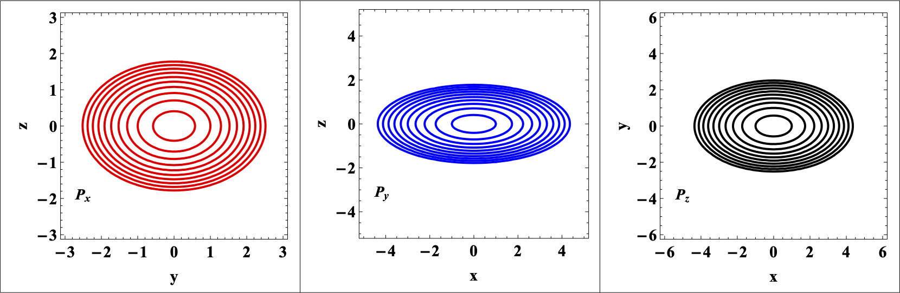

# Projecting the classical trajectories of the $^{163}$Lu triaxial nucleus onto a plane

**Goal:** From the classical trajectories of the triaxial spin states inside this isotope (given by the intersection of the *energy ellipsoid* and the *angular momentum sphere*), the projection of such trajectories must be represented onto a plane generated by any of the two angular momentum components (namely, $x_1$, $x_2$ or $x_3$).

Once the trajectories of the nucleus are determined (as a function of the Energy value for a given spin-state from one of the four TSD bands), their projections need to be added on a 2d graphical representation.

## Sources for the project:

[One](https://math.stackexchange.com/questions/573055/projection-of-ellipsoid)

[Two](https://math.stackexchange.com/questions/1187285/how-to-get-projection-of-ellipsoid-onto-sphere?rq=1)

[Three](https://math.stackexchange.com/questions/1817689/projection-of-an-ellipsoid-on-xy-plane?rq=1)

[Four](https://math.stackexchange.com/questions/3610652/find-x-y-z-maximum-and-minimum-points-of-ellipsoid?rq=1)

[Five](https://math.stackexchange.com/questions/1592118/intersection-of-2d-plane-and-n-dimensional-ellipsoid?rq=1)

## Workflow

Using the `ContourPlot` function, the projection of the ellipsoid onto each of the 3 planes was done.

```
cpx[e_, a1_, a2_, a3_, ax_] := 
 ContourPlot[pEx[a1, a2, a3] == e, {y, -ax, ax}, {z, -ax, ax}, 
  Contours -> 1, ContourStyle -> {Red, Thick}, Frame -> True, 
  FrameStyle -> Directive[Black], FrameLabel -> {"y", "z"}, 
  AspectRatio -> Automatic, 
  Epilog -> 
   Inset[Style["\!\(\*SubscriptBox[\(P\), \(x\)]\)", Bold, Black, 14, 
     FontFamily -> "Times New Roman"], Scaled[{0.1, 0.2}]],
```

The `Contours->1` marks the fact that only one line will be represented on the 2d-plot, that is the contour which represents the ellipse projected on each axes.

Using a `Table`, several values of the energy were attributed to the ellipsoid. For each plane, all the energies are represented as contour lines with a certain color.

Using an `Export` function, the final grid of contours (where each plot represents the projections of the ellipsoid evaluated at all the energies, onto all three axes) is saved as an external file.

```
inset[fig_] := 
  Graphics[Inset[Show[fig], Automatic, Automatic, Scaled[1]]];
tbx[emin_, emax_] := Table[cpx[en, 1, 3, 6, 3], {en, emin, emax, 2}];
tby[emin_, emax_] := Table[cpy[en, 1, 3, 6, 5], {en, emin, emax, 2}];
tbz[emin_, emax_] := Table[cpz[en, 1, 3, 6, 6], {en, emin, emax, 2}];
grid = GraphicsGrid[{{inset[tbx[1, 20]], inset[tby[1, 20]], 
    inset[tbz[1, 20]]}}, Frame -> All]
Export["/Users/robertpoenaru/Library/Mobile \
Documents/com~apple~CloudDocs/Work/Pipeline/DFT/legendary-fiesta/math/\
reports/TrajectoryProjection/projections.eps", grid, 
  ImageResolution -> 3000, ImageSize -> Scaled[2]];
```



